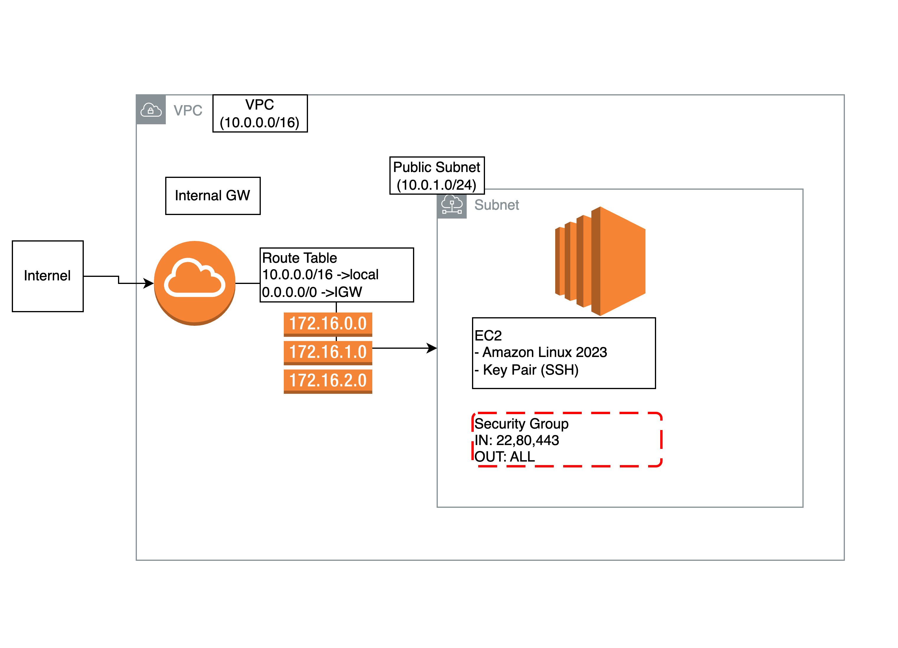

# Terraform EC2 Demo Project

使用 Terraform 在 AWS 上建立一台 EC2，包含完整的網路層和安全設定。

## 架構圖

<!-- TODO(human): 用 draw.io 畫完架構圖後，匯出 PNG 放在此目錄，取消下方註解 -->


## 資源清單

| 資源 | 說明 |
|------|------|
| VPC | 10.0.0.0/16，含 DNS 支援 |
| Public Subnet | 10.0.1.0/24，自動分配 Public IP |
| Internet Gateway | 讓 VPC 能對外連線 |
| Route Table | 0.0.0.0/0 → IGW |
| Security Group | SSH (22)、HTTP (80)、HTTPS (443) |
| EC2 Instance | t2.micro，Amazon Linux 2023 |
| Key Pair | 自動產生 RSA 4096 金鑰 |

## 使用方式

```bash
# 1. 初始化
terraform init

# 2. 複製並編輯變數檔
cp terraform.tfvars.example terraform.tfvars
# 編輯 terraform.tfvars，設定 allowed_ssh_cidr 為你的 IP

# 3. 預覽變更
terraform plan

# 4. 部署
terraform apply

# 5. SSH 連線（部署後會顯示指令）
ssh -i my-ec2-key.pem ec2-user@<PUBLIC_IP>

# 6. 銷毀資源
terraform destroy
```

## 檔案結構

```
.
├── main.tf                  # Provider 設定、Terraform 版本約束
├── variables.tf             # 變數宣告
├── outputs.tf               # 輸出值（Public IP、SSH 指令等）
├── terraform.tfvars.example # 變數範例檔
├── vpc.tf                   # VPC、Subnet、IGW、Route Table
├── security_group.tf        # Security Group 規則
├── ec2.tf                   # EC2 Instance、Key Pair
├── .gitignore               # 忽略敏感檔案
└── README.md
```

## 注意事項

- `terraform.tfvars` 含敏感設定，已被 `.gitignore` 排除
- `*.pem` 私鑰檔不會進 git，請妥善保管
- `*.tfstate` 含資源詳細資訊（包含密鑰），絕對不可進 git
- 練習完畢請務必執行 `terraform destroy` 避免產生費用
